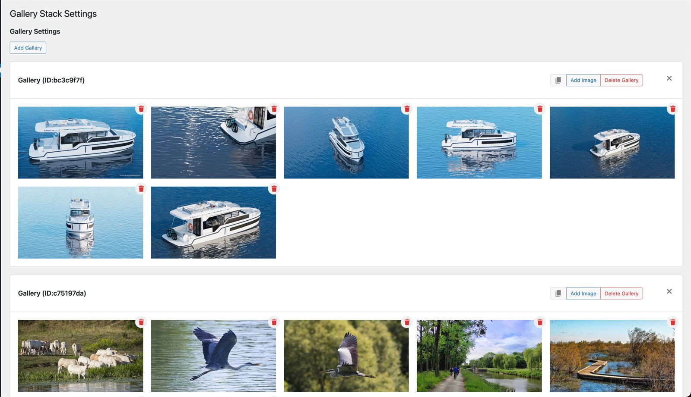

# Gallery Stack

A simple WordPress plugin to display and manage images in a gallery stack.

## Setup Guide

- Clone the repo:

```bash
git clone git@github.com:abhi3315/gallery-stack.git
```

- Setup WordPress plugin

```bash
npm run init
```

## Development Guide

- To build the plugin, run the following command:

```bash
npm run build
```

- To start the development server, use the following command:

```bash
npm run start
```

- To format the files, run the following command:

```bash
npm run format
```

- To lint files run the following command:

```bash
npm run lint
```

Check the `package.json` for more scripts.

## Features

### Hero Section

The plugin registers a custom component named "Hero Section". In the inspector control of this block, you can find settings to customize the hero section. The available options include:

- Duration: Select the duration in seconds for the background images to slide.
- Background Images: Choose the images to display as the background in the hero section.

### Shortcode: Gallery Stack

The Gallery Stack plugin also includes a shortcode for displaying image galleries. To use the shortcode, use the following syntax:

```text
[gallery_stack gallery_id="<gallery-id>"]
```

Replace `<gallery-id>` with the actual ID of the gallery you want to display. The `gallery-id` can be found from the plugin setting.

### Custom Plugin Settings

The plugin provides a settings panel for managing the shortcode images and galleries. Within the custom plugin settings, you can perform the following actions:

- Add Gallery: Create a new gallery.
- Delete Gallery: Remove an existing gallery.
- Add Image: Add a new image to a specific gallery.
- Delete Image: Remove an image from a gallery.
- Copy Shortcode: Copy the gallery shortcode.



### Custom Style: Gallery Stack Separator

The plugin also registers a custom style called "Gallery Stack Separator" to the core/separator. This allows you to apply a unique separator style in your content.

---

Feel free to explore the code in this repository to understand the implementation of the Gallery Stack plugin and customize it according to your needs.

Note: Make sure to install and activate this plugin in your WordPress installation to utilize its features.
